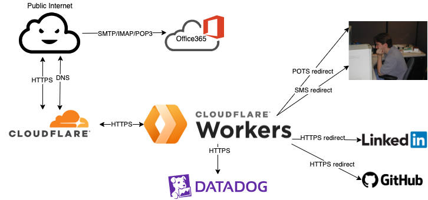

# flury.org

Makes a flury.org. Just a personal domain with a little static content and some redirects and DNS stuff.

This is a public repo because it's hosting files that say I'm good at computers and security, and I like irony.
It looks more sensitive than it is though. I think. It probably isn't super useful to other people as-is, but
it could help if you're trying to use terraform/ansible to set up personal domain hosting. Maybe? Not likely.




## Repo Layout
|path|function|
|------|--------|
|ansible|configuration & templated htdocs static content|
|deploy.sh|deploys infrastructure/content by calling terraform and ansible|
|config.sh|configuration, including credentials for AWS+Cloudflare, example in `config.sh-example`|
|ssh-key.pub|ssh public key to access ec2 instances|
|ssh-key|ssh *private* key (doesn't exist in repo...create a new key pair if starting from scratch)|
|terraform|infrastructure spinup (AWS+Cloudflare)|

## Prerequisites

- terraform 1.1.2: https://www.terraform.io/downloads.html or via homebrew etc.
- ansible-playbook: `pip install ansible`.
- jq: `brew install jq`
- ssh private key.
- `config.sh`; create based off example file.

## Deployment

### Bootstrapping

If you haven't set anything up, you'll need to initialize terraform and create an S3 bucket for terraform's state file
first:

```bash
cd terraformm
SYMBOLIC_NAME=flury-org  # This is set in `config.sh`
# Ignore if this bucket has already been created:
aws s3 mb s3://$SYMBOLIC_NAME-tfstate
terraform init -backend-config=bucket=$SYMBOLIC_NAME-tfstate
terraform import aws_s3_bucket.flurydotorg-tfstate $SYMBOLIC_NAME-tfstate
```

### Deploying

Running the `deploy.sh` script will call terraform and ansible to create any AWS/cloudflare
infrastructure necessary and push your data.

```bash
|19:55:20|aflury@aflury:[flurydotorg]> ./deploy.sh
<...>
PLAY RECAP *********************************************************************************************************************************************************
35.165.79.132              : ok=8    changed=0    unreachable=0    failed=0    skipped=0    rescued=0    ignored=0   
```

<details>
  <summary>
    Full deploy output... :sunglasses:
  </summary>

```
|08:05:29|aflury@aflury:[flurydotorg]> ( cd terraform && AWS_PROFILE=personal terraform destroy )
<ok not FULL>
|08:07:12|aflury@aflury:[flurydotorg]> cat config.sh
export AWS_PROFILE=personal
export CLOUDFLARE_EMAIL=andrew+cloudflare@flupleasenospamry.org
export CLOUDFLARE_API_TOKEN=VEohnoyoudidnt
export DOMAIN=flury.org
export SYMBOLIC_NAME=flury-org
export DMARC_CNAME=_dmarc.bf.17.94.02.dns.agari.com
export RESUME_FILE=/Users/aflury/Documents/Resume-Andrew-Flury.pdf
export LINKEDIN_PROFILE=andrew-flury-47815a
|08:07:32|aflury@aflury:[flurydotorg]> ./deploy.sh

**************************************************
**
**  Running terraform apply
**
**************************************************

aws_s3_bucket.flurydotorg-tfstate: Refreshing state... [id=flury-org-tfstate]
aws_s3_bucket.flurydotorg_logs: Refreshing state... [id=flury-org-logs]

Terraform used the selected providers to generate the following execution plan. Resource actions are indicated with the
following symbols:
  + create

Terraform will perform the following actions:

  # aws_acm_certificate.flurydotorg will be created
  + resource "aws_acm_certificate" "flurydotorg" {
      + arn                       = (known after apply)
      + domain_name               = "flury.org"
      + domain_validation_options = [
          + {
              + domain_name           = "flury.org"
              + resource_record_name  = (known after apply)
              + resource_record_type  = (known after apply)
              + resource_record_value = (known after apply)
            },
          + {
              + domain_name           = "linkedin.flury.org"
              + resource_record_name  = (known after apply)
              + resource_record_type  = (known after apply)
              + resource_record_value = (known after apply)
            },
          + {
              + domain_name           = "message.flury.org"
              + resource_record_name  = (known after apply)
              + resource_record_type  = (known after apply)
              + resource_record_value = (known after apply)
            },
          + {
              + domain_name           = "resume.flury.org"
              + resource_record_name  = (known after apply)
              + resource_record_type  = (known after apply)
              + resource_record_value = (known after apply)
            },
          + {
              + domain_name           = "www.flury.org"
              + resource_record_name  = (known after apply)
              + resource_record_type  = (known after apply)
              + resource_record_value = (known after apply)
            },
          + {
              + domain_name           = "xn--rsum-bpad.flury.org"
              + resource_record_name  = (known after apply)
              + resource_record_type  = (known after apply)
              + resource_record_value = (known after apply)
            },
        ]
      + id                        = (known after apply)
      + status                    = (known after apply)
      + subject_alternative_names = [
          + "linkedin.flury.org",
          + "message.flury.org",
          + "resume.flury.org",
          + "www.flury.org",
          + "xn--rsum-bpad.flury.org",
        ]
      + tags_all                  = {
          + "Name" = "flury-org"
        }
      + validation_emails         = (known after apply)
      + validation_method         = "DNS"
    }

  # aws_acm_certificate_validation.flurydotorg will be created
  + resource "aws_acm_certificate_validation" "flurydotorg" {
      + certificate_arn         = (known after apply)
      + id                      = (known after apply)
      + validation_record_fqdns = (known after apply)
    }

  # aws_cloudwatch_log_group.flurydotorg will be created
  + resource "aws_cloudwatch_log_group" "flurydotorg" {
      + arn               = (known after apply)
      + id                = (known after apply)
      + name              = "flury-org"
      + retention_in_days = 0
      + tags_all          = {
          + "Name" = "flury-org"
        }
    }

  # aws_iam_instance_profile.flurydotorg will be created
  + resource "aws_iam_instance_profile" "flurydotorg" {
      + arn         = (known after apply)
      + create_date = (known after apply)
      + id          = (known after apply)
      + name        = "flurydotorg_instance_profile"
      + path        = "/"
      + role        = "flurydotorg_assume_role"
      + tags_all    = {
          + "Name" = "flury-org"
        }
      + unique_id   = (known after apply)
    }

  # aws_iam_role.flurydotorg_assume_role will be created
  + resource "aws_iam_role" "flurydotorg_assume_role" {
      + arn                   = (known after apply)
      + assume_role_policy    = jsonencode(
            {
              + Statement = [
                  + {
                      + Action    = "sts:AssumeRole"
                      + Effect    = "Allow"
                      + Principal = {
                          + Service = "ec2.amazonaws.com"
                        }
                      + Sid       = ""
                    },
                ]
              + Version   = "2012-10-17"
            }
        )
      + create_date           = (known after apply)
      + force_detach_policies = false
      + id                    = (known after apply)
      + managed_policy_arns   = (known after apply)
      + max_session_duration  = 3600
      + name                  = "flurydotorg_assume_role"
      + name_prefix           = (known after apply)
      + path                  = "/"
      + tags_all              = {
          + "Name" = "flury-org"
        }
      + unique_id             = (known after apply)

      + inline_policy {
          + name   = (known after apply)
          + policy = (known after apply)
        }
    }

  # aws_iam_role_policy.flurydotorg_log_policy will be created
  + resource "aws_iam_role_policy" "flurydotorg_log_policy" {
      + id     = (known after apply)
      + name   = "flurydotorg_log_policy"
      + policy = jsonencode(
            {
              + Statement = [
                  + {
                      + Action   = [
                          + "logs:PutLogEvents",
                          + "logs:DescribeLogStreams",
                          + "logs:CreateLogStream",
                          + "logs:CreateLogGroup",
                        ]
                      + Effect   = "Allow"
                      + Resource = "arn:aws:logs:us-west-2:020963292585:log-group:flury-org:log-stream:*"
                      + Sid      = ""
                    },
                ]
              + Version   = "2012-10-17"
            }
        )
      + role   = (known after apply)
    }

  # aws_instance.flurydotorg will be created
  + resource "aws_instance" "flurydotorg" {
      + ami                                  = "ami-09d9c897fc36713bf"
      + arn                                  = (known after apply)
      + associate_public_ip_address          = (known after apply)
      + availability_zone                    = (known after apply)
      + cpu_core_count                       = (known after apply)
      + cpu_threads_per_core                 = (known after apply)
      + disable_api_termination              = (known after apply)
      + ebs_optimized                        = (known after apply)
      + get_password_data                    = false
      + hibernation                          = false
      + host_id                              = (known after apply)
      + iam_instance_profile                 = "flurydotorg_instance_profile"
      + id                                   = (known after apply)
      + instance_initiated_shutdown_behavior = (known after apply)
      + instance_state                       = (known after apply)
      + instance_type                        = "t4g.nano"
      + ipv6_address_count                   = (known after apply)
      + ipv6_addresses                       = (known after apply)
      + key_name                             = "flurydotorg-ssh"
      + monitoring                           = (known after apply)
      + outpost_arn                          = (known after apply)
      + password_data                        = (known after apply)
      + placement_group                      = (known after apply)
      + placement_partition_number           = (known after apply)
      + primary_network_interface_id         = (known after apply)
      + private_dns                          = (known after apply)
      + private_ip                           = (known after apply)
      + public_dns                           = (known after apply)
      + public_ip                            = (known after apply)
      + secondary_private_ips                = (known after apply)
      + security_groups                      = (known after apply)
      + source_dest_check                    = true
      + subnet_id                            = "subnet-23602f45"
      + tags_all                             = {
          + "Name" = "flury-org"
        }
      + tenancy                              = (known after apply)
      + user_data                            = (known after apply)
      + user_data_base64                     = (known after apply)
      + vpc_security_group_ids               = (known after apply)

      + capacity_reservation_specification {
          + capacity_reservation_preference = (known after apply)

          + capacity_reservation_target {
              + capacity_reservation_id = (known after apply)
            }
        }

      + ebs_block_device {
          + delete_on_termination = (known after apply)
          + device_name           = (known after apply)
          + encrypted             = (known after apply)
          + iops                  = (known after apply)
          + kms_key_id            = (known after apply)
          + snapshot_id           = (known after apply)
          + tags                  = (known after apply)
          + throughput            = (known after apply)
          + volume_id             = (known after apply)
          + volume_size           = (known after apply)
          + volume_type           = (known after apply)
        }

      + enclave_options {
          + enabled = (known after apply)
        }

      + ephemeral_block_device {
          + device_name  = (known after apply)
          + no_device    = (known after apply)
          + virtual_name = (known after apply)
        }

      + metadata_options {
          + http_endpoint               = (known after apply)
          + http_put_response_hop_limit = (known after apply)
          + http_tokens                 = (known after apply)
        }

      + network_interface {
          + delete_on_termination = (known after apply)
          + device_index          = (known after apply)
          + network_interface_id  = (known after apply)
        }

      + root_block_device {
          + delete_on_termination = (known after apply)
          + device_name           = (known after apply)
          + encrypted             = (known after apply)
          + iops                  = (known after apply)
          + kms_key_id            = (known after apply)
          + tags                  = (known after apply)
          + throughput            = (known after apply)
          + volume_id             = (known after apply)
          + volume_size           = (known after apply)
          + volume_type           = (known after apply)
        }
    }

  # aws_key_pair.flurydotorg-ssh will be created
  + resource "aws_key_pair" "flurydotorg-ssh" {
      + arn             = (known after apply)
      + fingerprint     = (known after apply)
      + id              = (known after apply)
      + key_name        = "flurydotorg-ssh"
      + key_name_prefix = (known after apply)
      + key_pair_id     = (known after apply)
      + public_key      = "ssh-rsa AAAAB3NzaC1yc2EAAAADAQABAAABgQDnT6F5F6ZsQ2Y928mm8elpOpBRI/CVgsJ5qD7FkBc53LSAJRG/3ezOVeJ+ybLBeY6sCIFKQ3lh74vKKSShGVq5ImM+1qZ05bm5v8AqOM1EQ9DCYDNGYuWokUDYZ2e3cwKbvHVXswJO9D7Xf+uv+zEFrlZGi6wsRZEQ312g3DBukZr/D3Al0RhO4LV67eyh8GjvKbuHDIlH/vfY3buK0yqGpi+xMYvv0qbmdnyar/Y4t/3xB+xjQEcP70YRAe/YiJaqQt8/J5yfbcTZi8HuRaLN2u3lVk+DZlBqsJeJIP2g61HCocetqfM1vRu1q8YnTcXkKoE/mODot8W1hG0Jy4LIpzNN1b9nMrXVna/REJZTXzL8JhqYJ44yN4cQy2mH3vcik0Rad4H0zttooNbsfyHw7F51vFElel1f+nczplVsTiicgQR3Q/dmkdQtCcNLCiSrAM9ejsK6xzFCh5yzuQqhPBmbJUNWOo4jeuVwuLdIB6AY8OXBiXb/89hA+GzOuu8= aflury@aflury"
      + tags_all        = {
          + "Name" = "flury-org"
        }
    }

  # aws_lb.flurydotorg will be created
  + resource "aws_lb" "flurydotorg" {
      + arn                        = (known after apply)
      + arn_suffix                 = (known after apply)
      + desync_mitigation_mode     = "defensive"
      + dns_name                   = (known after apply)
      + drop_invalid_header_fields = false
      + enable_deletion_protection = false
      + enable_http2               = true
      + enable_waf_fail_open       = false
      + id                         = (known after apply)
      + idle_timeout               = 60
      + internal                   = false
      + ip_address_type            = (known after apply)
      + load_balancer_type         = "application"
      + name                       = "flurydotorg-lb"
      + security_groups            = (known after apply)
      + subnets                    = [
          + "subnet-23602f45",
          + "subnet-cb127d83",
        ]
      + tags_all                   = {
          + "Name" = "flury-org"
        }
      + vpc_id                     = (known after apply)
      + zone_id                    = (known after apply)

      + access_logs {
          + bucket  = "flury-org-logs"
          + enabled = true
          + prefix  = "flurydotorg-lb"
        }

      + subnet_mapping {
          + allocation_id        = (known after apply)
          + ipv6_address         = (known after apply)
          + outpost_id           = (known after apply)
          + private_ipv4_address = (known after apply)
          + subnet_id            = (known after apply)
        }
    }

  # aws_lb_listener.flurydotorg_https will be created
  + resource "aws_lb_listener" "flurydotorg_https" {
      + arn               = (known after apply)
      + certificate_arn   = (known after apply)
      + id                = (known after apply)
      + load_balancer_arn = (known after apply)
      + port              = 443
      + protocol          = "HTTPS"
      + ssl_policy        = (known after apply)
      + tags_all          = {
          + "Name" = "flury-org"
        }

      + default_action {
          + order            = (known after apply)
          + target_group_arn = (known after apply)
          + type             = "forward"
        }
    }

  # aws_lb_target_group.flurydotorg will be created
  + resource "aws_lb_target_group" "flurydotorg" {
      + arn                                = (known after apply)
      + arn_suffix                         = (known after apply)
      + connection_termination             = false
      + deregistration_delay               = "300"
      + id                                 = (known after apply)
      + lambda_multi_value_headers_enabled = false
      + load_balancing_algorithm_type      = (known after apply)
      + name                               = "flurydotorg"
      + port                               = 80
      + preserve_client_ip                 = (known after apply)
      + protocol                           = "HTTP"
      + protocol_version                   = (known after apply)
      + proxy_protocol_v2                  = false
      + slow_start                         = 0
      + tags_all                           = {
          + "Name" = "flury-org"
        }
      + target_type                        = "instance"
      + vpc_id                             = "vpc-c24344a4"

      + health_check {
          + enabled             = (known after apply)
          + healthy_threshold   = (known after apply)
          + interval            = (known after apply)
          + matcher             = (known after apply)
          + path                = (known after apply)
          + port                = (known after apply)
          + protocol            = (known after apply)
          + timeout             = (known after apply)
          + unhealthy_threshold = (known after apply)
        }

      + stickiness {
          + cookie_duration = (known after apply)
          + cookie_name     = (known after apply)
          + enabled         = (known after apply)
          + type            = (known after apply)
        }
    }

  # aws_lb_target_group_attachment.flurydotorg will be created
  + resource "aws_lb_target_group_attachment" "flurydotorg" {
      + id               = (known after apply)
      + target_group_arn = (known after apply)
      + target_id        = (known after apply)
    }

  # aws_security_group.flurydotorg will be created
  + resource "aws_security_group" "flurydotorg" {
      + arn                    = (known after apply)
      + description            = "Managed by Terraform"
      + egress                 = (known after apply)
      + id                     = (known after apply)
      + ingress                = (known after apply)
      + name                   = "flurydotorg"
      + name_prefix            = (known after apply)
      + owner_id               = (known after apply)
      + revoke_rules_on_delete = false
      + tags_all               = {
          + "Name" = "flury-org"
        }
      + vpc_id                 = "vpc-c24344a4"
    }

  # aws_security_group.flurydotorg_lb will be created
  + resource "aws_security_group" "flurydotorg_lb" {
      + arn                    = (known after apply)
      + description            = "Managed by Terraform"
      + egress                 = (known after apply)
      + id                     = (known after apply)
      + ingress                = (known after apply)
      + name                   = "flurydotorg-lb"
      + name_prefix            = (known after apply)
      + owner_id               = (known after apply)
      + revoke_rules_on_delete = false
      + tags_all               = {
          + "Name" = "flury-org"
        }
      + vpc_id                 = "vpc-c24344a4"
    }

  # aws_security_group_rule.allow_inbound_http will be created
  + resource "aws_security_group_rule" "allow_inbound_http" {
      + from_port                = 80
      + id                       = (known after apply)
      + protocol                 = "tcp"
      + security_group_id        = (known after apply)
      + self                     = false
      + source_security_group_id = (known after apply)
      + to_port                  = 80
      + type                     = "ingress"
    }

  # aws_security_group_rule.allow_inbound_ssh will be created
  + resource "aws_security_group_rule" "allow_inbound_ssh" {
      + cidr_blocks              = [
          + "0.0.0.0/0",
        ]
      + from_port                = 22
      + id                       = (known after apply)
      + protocol                 = "tcp"
      + security_group_id        = (known after apply)
      + self                     = false
      + source_security_group_id = (known after apply)
      + to_port                  = 22
      + type                     = "ingress"
    }

  # aws_security_group_rule.allow_outbound will be created
  + resource "aws_security_group_rule" "allow_outbound" {
      + cidr_blocks              = [
          + "0.0.0.0/0",
        ]
      + from_port                = 0
      + id                       = (known after apply)
      + protocol                 = "-1"
      + security_group_id        = (known after apply)
      + self                     = false
      + source_security_group_id = (known after apply)
      + to_port                  = 65535
      + type                     = "egress"
    }

  # aws_security_group_rule.lb_allow_inbound_https will be created
  + resource "aws_security_group_rule" "lb_allow_inbound_https" {
      + cidr_blocks              = [
          + "103.21.244.0/22",
          + "103.22.200.0/22",
          + "103.31.4.0/22",
          + "104.16.0.0/13",
          + "104.24.0.0/14",
          + "108.162.192.0/18",
          + "131.0.72.0/22",
          + "141.101.64.0/18",
          + "162.158.0.0/15",
          + "172.64.0.0/13",
          + "173.245.48.0/20",
          + "188.114.96.0/20",
          + "190.93.240.0/20",
          + "197.234.240.0/22",
          + "198.41.128.0/17",
        ]
      + from_port                = 443
      + id                       = (known after apply)
      + protocol                 = "tcp"
      + security_group_id        = (known after apply)
      + self                     = false
      + source_security_group_id = (known after apply)
      + to_port                  = 443
      + type                     = "ingress"
    }

  # aws_security_group_rule.lb_allow_outbound will be created
  + resource "aws_security_group_rule" "lb_allow_outbound" {
      + cidr_blocks              = [
          + "0.0.0.0/0",
        ]
      + from_port                = 0
      + id                       = (known after apply)
      + protocol                 = "tcp"
      + security_group_id        = (known after apply)
      + self                     = false
      + source_security_group_id = (known after apply)
      + to_port                  = 65535
      + type                     = "egress"
    }

  # cloudflare_record.address will be created
  + resource "cloudflare_record" "address" {
      + allow_overwrite = false
      + created_on      = (known after apply)
      + hostname        = (known after apply)
      + id              = (known after apply)
      + metadata        = (known after apply)
      + modified_on     = (known after apply)
      + name            = "ec2"
      + proxiable       = (known after apply)
      + proxied         = false
      + ttl             = 300
      + type            = "A"
      + value           = (known after apply)
      + zone_id         = (known after apply)
    }

  # cloudflare_record.autodiscover will be created
  + resource "cloudflare_record" "autodiscover" {
      + allow_overwrite = false
      + created_on      = (known after apply)
      + hostname        = (known after apply)
      + id              = (known after apply)
      + metadata        = (known after apply)
      + modified_on     = (known after apply)
      + name            = "autodiscover"
      + proxiable       = (known after apply)
      + proxied         = false
      + ttl             = 300
      + type            = "CNAME"
      + value           = "autodiscover.outlook.com"
      + zone_id         = (known after apply)
    }

  # cloudflare_record.dmarc will be created
  + resource "cloudflare_record" "dmarc" {
      + allow_overwrite = false
      + created_on      = (known after apply)
      + hostname        = (known after apply)
      + id              = (known after apply)
      + metadata        = (known after apply)
      + modified_on     = (known after apply)
      + name            = "_dmarc"
      + proxiable       = (known after apply)
      + proxied         = false
      + ttl             = 300
      + type            = "CNAME"
      + value           = "_dmarc.bf.17.94.02.dns.agari.com"
      + zone_id         = (known after apply)
    }

  # cloudflare_record.flurydotorg will be created
  + resource "cloudflare_record" "flurydotorg" {
      + allow_overwrite = false
      + created_on      = (known after apply)
      + hostname        = (known after apply)
      + id              = (known after apply)
      + metadata        = (known after apply)
      + modified_on     = (known after apply)
      + name            = "flury.org."
      + proxiable       = (known after apply)
      + proxied         = true
      + ttl             = 1
      + type            = "CNAME"
      + value           = (known after apply)
      + zone_id         = (known after apply)
    }

  # cloudflare_record.linkedin will be created
  + resource "cloudflare_record" "linkedin" {
      + allow_overwrite = false
      + created_on      = (known after apply)
      + hostname        = (known after apply)
      + id              = (known after apply)
      + metadata        = (known after apply)
      + modified_on     = (known after apply)
      + name            = "linkedin"
      + proxiable       = (known after apply)
      + proxied         = true
      + ttl             = 1
      + type            = "CNAME"
      + value           = "flury.org"
      + zone_id         = (known after apply)
    }

  # cloudflare_record.message will be created
  + resource "cloudflare_record" "message" {
      + allow_overwrite = false
      + created_on      = (known after apply)
      + hostname        = (known after apply)
      + id              = (known after apply)
      + metadata        = (known after apply)
      + modified_on     = (known after apply)
      + name            = "message"
      + proxiable       = (known after apply)
      + proxied         = true
      + ttl             = 1
      + type            = "CNAME"
      + value           = "flury.org"
      + zone_id         = (known after apply)
    }

  # cloudflare_record.mx will be created
  + resource "cloudflare_record" "mx" {
      + allow_overwrite = false
      + created_on      = (known after apply)
      + hostname        = (known after apply)
      + id              = (known after apply)
      + metadata        = (known after apply)
      + modified_on     = (known after apply)
      + name            = "flury.org."
      + priority        = 10
      + proxiable       = (known after apply)
      + proxied         = false
      + ttl             = 300
      + type            = "MX"
      + value           = "flury-org.mail.protection.outlook.com"
      + zone_id         = (known after apply)
    }

  # cloudflare_record.resume will be created
  + resource "cloudflare_record" "resume" {
      + allow_overwrite = false
      + created_on      = (known after apply)
      + hostname        = (known after apply)
      + id              = (known after apply)
      + metadata        = (known after apply)
      + modified_on     = (known after apply)
      + name            = "resume"
      + proxiable       = (known after apply)
      + proxied         = true
      + ttl             = 1
      + type            = "CNAME"
      + value           = "flury.org"
      + zone_id         = (known after apply)
    }

  # cloudflare_record.resume_ will be created
  + resource "cloudflare_record" "resume_" {
      + allow_overwrite = false
      + created_on      = (known after apply)
      + hostname        = (known after apply)
      + id              = (known after apply)
      + metadata        = (known after apply)
      + modified_on     = (known after apply)
      + name            = "xn--rsum-bpad"
      + proxiable       = (known after apply)
      + proxied         = true
      + ttl             = 1
      + type            = "CNAME"
      + value           = "flury.org"
      + zone_id         = (known after apply)
    }

  # cloudflare_record.selector1 will be created
  + resource "cloudflare_record" "selector1" {
      + allow_overwrite = false
      + created_on      = (known after apply)
      + hostname        = (known after apply)
      + id              = (known after apply)
      + metadata        = (known after apply)
      + modified_on     = (known after apply)
      + name            = "selector1._domainkey"
      + proxiable       = (known after apply)
      + proxied         = false
      + ttl             = 300
      + type            = "CNAME"
      + value           = "selector1-flury-org._domainkey.flurydotorg.onmicrosoft.com"
      + zone_id         = (known after apply)
    }

  # cloudflare_record.selector2 will be created
  + resource "cloudflare_record" "selector2" {
      + allow_overwrite = false
      + created_on      = (known after apply)
      + hostname        = (known after apply)
      + id              = (known after apply)
      + metadata        = (known after apply)
      + modified_on     = (known after apply)
      + name            = "selector2._domainkey"
      + proxiable       = (known after apply)
      + proxied         = false
      + ttl             = 300
      + type            = "CNAME"
      + value           = "selector2-flury-org._domainkey.flurydotorg.onmicrosoft.com"
      + zone_id         = (known after apply)
    }

  # cloudflare_record.spf will be created
  + resource "cloudflare_record" "spf" {
      + allow_overwrite = false
      + created_on      = (known after apply)
      + hostname        = (known after apply)
      + id              = (known after apply)
      + metadata        = (known after apply)
      + modified_on     = (known after apply)
      + name            = "flury.org."
      + proxiable       = (known after apply)
      + proxied         = false
      + ttl             = 300
      + type            = "TXT"
      + value           = "v=spf1 include:spf.protection.outlook.com -all"
      + zone_id         = (known after apply)
    }

  # cloudflare_record.validate_tls["flury.org"] will be created
  + resource "cloudflare_record" "validate_tls" {
      + allow_overwrite = true
      + created_on      = (known after apply)
      + hostname        = (known after apply)
      + id              = (known after apply)
      + metadata        = (known after apply)
      + modified_on     = (known after apply)
      + name            = (known after apply)
      + proxiable       = (known after apply)
      + ttl             = 60
      + type            = (known after apply)
      + value           = (known after apply)
      + zone_id         = (known after apply)
    }

  # cloudflare_record.validate_tls["linkedin.flury.org"] will be created
  + resource "cloudflare_record" "validate_tls" {
      + allow_overwrite = true
      + created_on      = (known after apply)
      + hostname        = (known after apply)
      + id              = (known after apply)
      + metadata        = (known after apply)
      + modified_on     = (known after apply)
      + name            = (known after apply)
      + proxiable       = (known after apply)
      + ttl             = 60
      + type            = (known after apply)
      + value           = (known after apply)
      + zone_id         = (known after apply)
    }

  # cloudflare_record.validate_tls["message.flury.org"] will be created
  + resource "cloudflare_record" "validate_tls" {
      + allow_overwrite = true
      + created_on      = (known after apply)
      + hostname        = (known after apply)
      + id              = (known after apply)
      + metadata        = (known after apply)
      + modified_on     = (known after apply)
      + name            = (known after apply)
      + proxiable       = (known after apply)
      + ttl             = 60
      + type            = (known after apply)
      + value           = (known after apply)
      + zone_id         = (known after apply)
    }

  # cloudflare_record.validate_tls["resume.flury.org"] will be created
  + resource "cloudflare_record" "validate_tls" {
      + allow_overwrite = true
      + created_on      = (known after apply)
      + hostname        = (known after apply)
      + id              = (known after apply)
      + metadata        = (known after apply)
      + modified_on     = (known after apply)
      + name            = (known after apply)
      + proxiable       = (known after apply)
      + ttl             = 60
      + type            = (known after apply)
      + value           = (known after apply)
      + zone_id         = (known after apply)
    }

  # cloudflare_record.validate_tls["www.flury.org"] will be created
  + resource "cloudflare_record" "validate_tls" {
      + allow_overwrite = true
      + created_on      = (known after apply)
      + hostname        = (known after apply)
      + id              = (known after apply)
      + metadata        = (known after apply)
      + modified_on     = (known after apply)
      + name            = (known after apply)
      + proxiable       = (known after apply)
      + ttl             = 60
      + type            = (known after apply)
      + value           = (known after apply)
      + zone_id         = (known after apply)
    }

  # cloudflare_record.validate_tls["xn--rsum-bpad.flury.org"] will be created
  + resource "cloudflare_record" "validate_tls" {
      + allow_overwrite = true
      + created_on      = (known after apply)
      + hostname        = (known after apply)
      + id              = (known after apply)
      + metadata        = (known after apply)
      + modified_on     = (known after apply)
      + name            = (known after apply)
      + proxiable       = (known after apply)
      + ttl             = 60
      + type            = (known after apply)
      + value           = (known after apply)
      + zone_id         = (known after apply)
    }

  # cloudflare_record.www will be created
  + resource "cloudflare_record" "www" {
      + allow_overwrite = false
      + created_on      = (known after apply)
      + hostname        = (known after apply)
      + id              = (known after apply)
      + metadata        = (known after apply)
      + modified_on     = (known after apply)
      + name            = "www"
      + proxiable       = (known after apply)
      + proxied         = true
      + ttl             = 1
      + type            = "CNAME"
      + value           = "flury.org"
      + zone_id         = (known after apply)
    }

  # cloudflare_zone.flurydotorg will be created
  + resource "cloudflare_zone" "flurydotorg" {
      + id                  = (known after apply)
      + meta                = (known after apply)
      + name_servers        = (known after apply)
      + plan                = (known after apply)
      + status              = (known after apply)
      + type                = "full"
      + vanity_name_servers = (known after apply)
      + verification_key    = (known after apply)
      + zone                = "flury.org"
    }

Plan: 39 to add, 0 to change, 0 to destroy.

Do you want to perform these actions?
  Terraform will perform the actions described above.
  Only 'yes' will be accepted to approve.

  Enter a value: yes

cloudflare_zone.flurydotorg: Creating...
aws_key_pair.flurydotorg-ssh: Creating...
aws_security_group.flurydotorg: Creating...
aws_cloudwatch_log_group.flurydotorg: Creating...
aws_lb_target_group.flurydotorg: Creating...
aws_security_group.flurydotorg_lb: Creating...
aws_iam_role.flurydotorg_assume_role: Creating...
aws_acm_certificate.flurydotorg: Creating...
cloudflare_zone.flurydotorg: Creation complete after 2s [id=aaa37b82133deae64fc7a3c76ad95896]
cloudflare_record.linkedin: Creating...
cloudflare_record.selector1: Creating...
cloudflare_record.resume_: Creating...
aws_key_pair.flurydotorg-ssh: Creation complete after 5s [id=flurydotorg-ssh]
cloudflare_record.spf: Creating...
cloudflare_record.resume_: Creation complete after 6s [id=0e435b7583b04bb7f3e12c46f444919d]
cloudflare_record.selector2: Creating...
aws_cloudwatch_log_group.flurydotorg: Creation complete after 6s [id=flury-org]
cloudflare_record.resume: Creating...
aws_iam_role.flurydotorg_assume_role: Creation complete after 8s [id=flurydotorg_assume_role]
cloudflare_record.dmarc: Creating...
aws_acm_certificate.flurydotorg: Creation complete after 8s [id=arn:aws:acm:us-west-2:020963292585:certificate/3ca1f203-60ac-48ca-9f49-ac17ffef3b52]
cloudflare_record.autodiscover: Creating...
aws_security_group.flurydotorg: Still creating... [10s elapsed]
aws_lb_target_group.flurydotorg: Still creating... [10s elapsed]
aws_security_group.flurydotorg_lb: Still creating... [10s elapsed]
cloudflare_record.selector1: Still creating... [10s elapsed]
cloudflare_record.linkedin: Still creating... [10s elapsed]
cloudflare_record.linkedin: Creation complete after 10s [id=65a92e0e11a7de8760132faed5cb64c5]
cloudflare_record.message: Creating...
cloudflare_record.selector1: Creation complete after 11s [id=e7d25a5c3bc2e9ebbb1ccc774f8a04a0]
cloudflare_record.www: Creating...
cloudflare_record.selector2: Creation complete after 5s [id=3507eaae438cce0ba64c1cb104eea4ed]
cloudflare_record.mx: Creating...
cloudflare_record.spf: Still creating... [10s elapsed]
cloudflare_record.resume: Creation complete after 10s [id=ec6992b2214fee69df83eab6a955e6d3]
aws_iam_instance_profile.flurydotorg: Creating...
cloudflare_record.spf: Creation complete after 11s [id=6f54e6a9f1482a98a5080feca5d5ccb9]
aws_iam_role_policy.flurydotorg_log_policy: Creating...
cloudflare_record.autodiscover: Creation complete after 8s [id=01da79ab7b9a1f945e517372a71d0d9d]
cloudflare_record.validate_tls["linkedin.flury.org"]: Creating...
cloudflare_record.dmarc: Creation complete after 8s [id=8fe031a1e7ece0fc5c9057584a83f3f6]
cloudflare_record.validate_tls["resume.flury.org"]: Creating...
aws_lb_target_group.flurydotorg: Creation complete after 16s [id=arn:aws:elasticloadbalancing:us-west-2:020963292585:targetgroup/flurydotorg/8c0a07dcca97d8c8]
cloudflare_record.validate_tls["xn--rsum-bpad.flury.org"]: Creating...
aws_security_group.flurydotorg: Creation complete after 17s [id=sg-0a57afef7defb4654]
aws_security_group.flurydotorg_lb: Creation complete after 17s [id=sg-0f168cddd6c35de79]
cloudflare_record.validate_tls["www.flury.org"]: Creating...
cloudflare_record.validate_tls["flury.org"]: Creating...
cloudflare_record.message: Still creating... [10s elapsed]
cloudflare_record.www: Still creating... [10s elapsed]
cloudflare_record.mx: Still creating... [10s elapsed]
cloudflare_record.www: Creation complete after 10s [id=ff64fac3ba30bb977eac4a69a7bc7b9a]
cloudflare_record.validate_tls["message.flury.org"]: Creating...
cloudflare_record.validate_tls["linkedin.flury.org"]: Creation complete after 5s [id=1f0895c06d65586d1023f715682cb609]
aws_security_group_rule.allow_outbound: Creating...
cloudflare_record.message: Creation complete after 11s [id=ce39dadc3b77e38ccea124155d13fdae]
aws_security_group_rule.allow_inbound_ssh: Creating...
cloudflare_record.mx: Creation complete after 10s [id=1f7a6be2e1b2f8bd2adf6ea3b25848c5]
aws_security_group_rule.allow_inbound_http: Creating...
aws_iam_role_policy.flurydotorg_log_policy: Creation complete after 6s [id=flurydotorg_assume_role:flurydotorg_log_policy]
aws_security_group_rule.lb_allow_outbound: Creating...
aws_iam_instance_profile.flurydotorg: Still creating... [10s elapsed]
cloudflare_record.validate_tls["resume.flury.org"]: Still creating... [10s elapsed]
cloudflare_record.validate_tls["xn--rsum-bpad.flury.org"]: Still creating... [10s elapsed]
cloudflare_record.validate_tls["www.flury.org"]: Creation complete after 10s [id=176171ce7e16c2afe3b8d970c70bc913]
aws_security_group_rule.lb_allow_inbound_https: Creating...
cloudflare_record.validate_tls["message.flury.org"]: Creation complete after 6s [id=01bb9c9ca47683478dbe8bfc3c3845da]
cloudflare_record.validate_tls["flury.org"]: Creation complete after 10s [id=e3552286c37ffffe0184e91342db1a52]
aws_lb.flurydotorg: Creating...
cloudflare_record.validate_tls["resume.flury.org"]: Creation complete after 11s [id=39a351954a2e2f9ccfd538762531f395]
cloudflare_record.validate_tls["xn--rsum-bpad.flury.org"]: Creation complete after 11s [id=a82d3a77e7988ff218eb43541f2cf72c]
aws_acm_certificate_validation.flurydotorg: Creating...
aws_security_group_rule.allow_outbound: Creation complete after 6s [id=sgrule-2705000199]
aws_iam_instance_profile.flurydotorg: Creation complete after 12s [id=flurydotorg_instance_profile]
aws_instance.flurydotorg: Creating...
aws_security_group_rule.allow_inbound_ssh: Still creating... [10s elapsed]
aws_security_group_rule.allow_inbound_http: Still creating... [10s elapsed]
aws_security_group_rule.lb_allow_outbound: Still creating... [10s elapsed]
aws_security_group_rule.lb_allow_outbound: Creation complete after 11s [id=sgrule-804698908]
aws_security_group_rule.allow_inbound_ssh: Creation complete after 12s [id=sgrule-2714857297]
aws_security_group_rule.lb_allow_inbound_https: Creation complete after 6s [id=sgrule-2956197850]
aws_security_group_rule.allow_inbound_http: Creation complete after 13s [id=sgrule-3624185629]
aws_lb.flurydotorg: Still creating... [10s elapsed]
aws_acm_certificate_validation.flurydotorg: Still creating... [10s elapsed]
aws_instance.flurydotorg: Still creating... [10s elapsed]
aws_acm_certificate_validation.flurydotorg: Creation complete after 17s [id=2022-01-04 16:08:30.947 +0000 UTC]
aws_instance.flurydotorg: Creation complete after 18s [id=i-031821c11a4ff86c0]
aws_lb_target_group_attachment.flurydotorg: Creating...
cloudflare_record.address: Creating...
aws_lb_target_group_attachment.flurydotorg: Creation complete after 1s [id=arn:aws:elasticloadbalancing:us-west-2:020963292585:targetgroup/flurydotorg/8c0a07dcca97d8c8-20220104160837724000000002]
aws_lb.flurydotorg: Still creating... [20s elapsed]
cloudflare_record.address: Creation complete after 1s [id=d6219b32dee8699fe5a17d406089792e]
aws_lb.flurydotorg: Still creating... [30s elapsed]
aws_lb.flurydotorg: Still creating... [40s elapsed]
aws_lb.flurydotorg: Still creating... [50s elapsed]
aws_lb.flurydotorg: Still creating... [1m0s elapsed]
aws_lb.flurydotorg: Still creating... [1m10s elapsed]
aws_lb.flurydotorg: Still creating... [1m20s elapsed]
aws_lb.flurydotorg: Still creating... [1m30s elapsed]
aws_lb.flurydotorg: Still creating... [1m40s elapsed]
aws_lb.flurydotorg: Still creating... [1m50s elapsed]
aws_lb.flurydotorg: Still creating... [2m0s elapsed]
aws_lb.flurydotorg: Creation complete after 2m4s [id=arn:aws:elasticloadbalancing:us-west-2:020963292585:loadbalancer/app/flurydotorg-lb/427b3f5bc8c965e2]
cloudflare_record.flurydotorg: Creating...
aws_lb_listener.flurydotorg_https: Creating...
cloudflare_record.flurydotorg: Creation complete after 0s [id=99f45b8160654bc0799651a5ccc70ba8]
aws_lb_listener.flurydotorg_https: Creation complete after 1s [id=arn:aws:elasticloadbalancing:us-west-2:020963292585:listener/app/flurydotorg-lb/427b3f5bc8c965e2/f0ec94a4d8182d00]

Apply complete! Resources: 39 added, 0 changed, 0 destroyed.
Warning: Permanently added '35.88.242.200' (ED25519) to the list of known hosts.
Hit:1 http://us-west-2.ec2.ports.ubuntu.com/ubuntu-ports focal InRelease
Get:2 http://us-west-2.ec2.ports.ubuntu.com/ubuntu-ports focal-updates InRelease [114 kB]
Get:3 http://us-west-2.ec2.ports.ubuntu.com/ubuntu-ports focal-backports InRelease [108 kB]
Get:4 http://us-west-2.ec2.ports.ubuntu.com/ubuntu-ports focal/universe arm64 Packages [8458 kB]
Get:5 http://us-west-2.ec2.ports.ubuntu.com/ubuntu-ports focal/universe Translation-en [5124 kB]
Get:6 http://ports.ubuntu.com/ubuntu-ports focal-security InRelease [114 kB]
Get:7 http://us-west-2.ec2.ports.ubuntu.com/ubuntu-ports focal/universe arm64 c-n-f Metadata [255 kB]
Get:8 http://us-west-2.ec2.ports.ubuntu.com/ubuntu-ports focal/multiverse arm64 Packages [114 kB]
Get:9 http://us-west-2.ec2.ports.ubuntu.com/ubuntu-ports focal/multiverse Translation-en [104 kB]
Get:10 http://us-west-2.ec2.ports.ubuntu.com/ubuntu-ports focal/multiverse arm64 c-n-f Metadata [8024 B]
Get:11 http://us-west-2.ec2.ports.ubuntu.com/ubuntu-ports focal-updates/main arm64 Packages [1019 kB]
Get:12 http://us-west-2.ec2.ports.ubuntu.com/ubuntu-ports focal-updates/main Translation-en [287 kB]
Get:13 http://us-west-2.ec2.ports.ubuntu.com/ubuntu-ports focal-updates/main arm64 c-n-f Metadata [14.2 kB]
Get:14 http://us-west-2.ec2.ports.ubuntu.com/ubuntu-ports focal-updates/restricted arm64 Packages [3184 B]
Get:15 http://us-west-2.ec2.ports.ubuntu.com/ubuntu-ports focal-updates/restricted Translation-en [93.0 kB]
Get:16 http://us-west-2.ec2.ports.ubuntu.com/ubuntu-ports focal-updates/universe arm64 Packages [834 kB]
Get:17 http://us-west-2.ec2.ports.ubuntu.com/ubuntu-ports focal-updates/universe Translation-en [193 kB]
Get:18 http://us-west-2.ec2.ports.ubuntu.com/ubuntu-ports focal-updates/universe arm64 c-n-f Metadata [18.3 kB]
Get:19 http://us-west-2.ec2.ports.ubuntu.com/ubuntu-ports focal-updates/multiverse arm64 Packages [8188 B]
Get:20 http://us-west-2.ec2.ports.ubuntu.com/ubuntu-ports focal-updates/multiverse Translation-en [6928 B]
Get:21 http://us-west-2.ec2.ports.ubuntu.com/ubuntu-ports focal-updates/multiverse arm64 c-n-f Metadata [380 B]
Get:22 http://us-west-2.ec2.ports.ubuntu.com/ubuntu-ports focal-backports/main arm64 Packages [41.9 kB]
Get:23 http://us-west-2.ec2.ports.ubuntu.com/ubuntu-ports focal-backports/main Translation-en [10.0 kB]
Get:24 http://us-west-2.ec2.ports.ubuntu.com/ubuntu-ports focal-backports/main arm64 c-n-f Metadata [864 B]
Get:25 http://us-west-2.ec2.ports.ubuntu.com/ubuntu-ports focal-backports/restricted arm64 c-n-f Metadata [116 B]
Get:26 http://us-west-2.ec2.ports.ubuntu.com/ubuntu-ports focal-backports/universe arm64 Packages [18.8 kB]
Get:27 http://us-west-2.ec2.ports.ubuntu.com/ubuntu-ports focal-backports/universe Translation-en [7492 B]
Get:28 http://us-west-2.ec2.ports.ubuntu.com/ubuntu-ports focal-backports/universe arm64 c-n-f Metadata [636 B]
Get:29 http://us-west-2.ec2.ports.ubuntu.com/ubuntu-ports focal-backports/multiverse arm64 c-n-f Metadata [116 B]
Get:30 http://ports.ubuntu.com/ubuntu-ports focal-security/main arm64 Packages [704 kB]
Get:31 http://ports.ubuntu.com/ubuntu-ports focal-security/main Translation-en [197 kB]
Get:32 http://ports.ubuntu.com/ubuntu-ports focal-security/main arm64 c-n-f Metadata [8744 B]
Get:33 http://ports.ubuntu.com/ubuntu-ports focal-security/restricted arm64 Packages [2984 B]
Get:34 http://ports.ubuntu.com/ubuntu-ports focal-security/restricted Translation-en [80.9 kB]
Get:35 http://ports.ubuntu.com/ubuntu-ports focal-security/restricted arm64 c-n-f Metadata [116 B]
Get:36 http://ports.ubuntu.com/ubuntu-ports focal-security/universe arm64 Packages [618 kB]
Get:37 http://ports.ubuntu.com/ubuntu-ports focal-security/universe Translation-en [112 kB]
Get:38 http://ports.ubuntu.com/ubuntu-ports focal-security/universe arm64 c-n-f Metadata [11.1 kB]
Get:39 http://ports.ubuntu.com/ubuntu-ports focal-security/multiverse arm64 Packages [3044 B]
Get:40 http://ports.ubuntu.com/ubuntu-ports focal-security/multiverse Translation-en [4948 B]
Get:41 http://ports.ubuntu.com/ubuntu-ports focal-security/multiverse arm64 c-n-f Metadata [116 B]
Fetched 18.7 MB in 2s (7772 kB/s)
Reading package lists...

**************************************************
**
**  Running ansible-playbook check
**
**************************************************


PLAY [servers] *********************************************************************************************************

TASK [Gathering Facts] *************************************************************************************************
ok: [35.88.242.200]

TASK [apt update] ******************************************************************************************************
ok: [35.88.242.200]

TASK [apt upgrade] *****************************************************************************************************
Calculating upgrade...
The following NEW packages will be installed:
  distro-info libatasmart4 libblockdev-crypto2 libblockdev-fs2
  libblockdev-loop2 libblockdev-part-err2 libblockdev-part2 libblockdev-swap2
  libblockdev-utils2 libblockdev2 libjcat1 libnspr4 libnss3
  libparted-fs-resize0 libudisks2-0 libvolume-key1
  linux-aws-5.11-headers-5.11.0-1023 linux-headers-5.11.0-1023-aws
  linux-image-5.11.0-1023-aws linux-modules-5.11.0-1023-aws udisks2
The following packages will be upgraded:
  accountsservice alsa-ucm-conf apport apt apt-utils base-files bind9-dnsutils
  bind9-host bind9-libs busybox-initramfs busybox-static ca-certificates
  cloud-init cloud-initramfs-copymods cloud-initramfs-dyn-netconf cpio curl
  distro-info-data flash-kernel fwupd fwupd-signed gcc-10-base git git-man
  grub-common grub-efi-arm64 grub-efi-arm64-bin grub2-common initramfs-tools
  initramfs-tools-bin initramfs-tools-core isc-dhcp-client isc-dhcp-common
  libaccountsservice0 libapt-pkg6.0 libasound2 libasound2-data libcurl3-gnutls
  libcurl4 libdrm-common libdrm2 libfwupd2 libfwupdplugin1 libgcc-s1
  libgcrypt20 libglib2.0-0 libglib2.0-bin libglib2.0-data libgnutls30
  libhogweed5 libicu66 liblz4-1 libnetplan0 libnettle7 libnss-systemd
  libntfs-3g883 libpam-modules libpam-modules-bin libpam-runtime
  libpam-systemd libpam0g libpolkit-agent-1-0 libpolkit-gobject-1-0 libprocps8
  libpython3.8 libpython3.8-minimal libpython3.8-stdlib libseccomp2 libssh-4
  libssl1.1 libstdc++6 libsystemd0 libtdb1 libudev1 libuv1 libx11-6
  libx11-data libxml2 libxmlb1 linux-aws linux-base linux-headers-aws
  linux-image-aws login lz4 motd-news-config netplan.io networkd-dispatcher
  ntfs-3g open-iscsi openssh-client openssh-server openssh-sftp-server openssl
  overlayroot passwd policykit-1 procps python-apt-common python3-apport
  python3-apt python3-distupgrade python3-distutils python3-gdbm
  python3-lib2to3 python3-problem-report python3-software-properties
  python3-update-manager python3-yaml python3.8 python3.8-minimal rsync snapd
  software-properties-common sosreport squashfs-tools systemd systemd-sysv
  systemd-timesyncd tmux tzdata u-boot-tools ubuntu-advantage-tools
  ubuntu-release-upgrader-core udev ufw update-manager-core
  update-notifier-common vim vim-common vim-runtime vim-tiny wget xxd
134 upgraded, 21 newly installed, 0 to remove and 0 not upgraded.
changed: [35.88.242.200]

TASK [check if reboot is required] *************************************************************************************
ok: [35.88.242.200]

TASK [reboot if required] **********************************************************************************************
skipping: [35.88.242.200]

TASK [create user aflury] **********************************************************************************************
changed: [35.88.242.200]

TASK [authorize users' keys] *******************************************************************************************
skipping: [35.88.242.200]

TASK [install packages] ************************************************************************************************
The following additional packages will be installed:
  fontconfig-config fonts-dejavu-core libfontconfig1 libgd3 libjbig0
  libjpeg-turbo8 libjpeg8 libnginx-mod-http-image-filter
  libnginx-mod-http-xslt-filter libnginx-mod-mail libnginx-mod-stream libtiff5
  libwebp6 libxpm4 libxslt1.1 nginx-common nginx-core
Suggested packages:
  libgd-tools fcgiwrap nginx-doc ssl-cert
The following NEW packages will be installed:
  fontconfig-config fonts-dejavu-core libfontconfig1 libgd3 libjbig0
  libjpeg-turbo8 libjpeg8 libnginx-mod-http-image-filter
  libnginx-mod-http-xslt-filter libnginx-mod-mail libnginx-mod-stream libtiff5
  libwebp6 libxpm4 libxslt1.1 nginx nginx-common nginx-core
0 upgraded, 18 newly installed, 0 to remove and 134 not upgraded.
changed: [35.88.242.200] => (item=nginx)
The following additional packages will be installed:
  libpython2-stdlib libpython2.7-minimal libpython2.7-stdlib python2-minimal
  python2.7 python2.7-minimal
Suggested packages:
  python2-doc python-tk python2.7-doc binutils binfmt-support
The following NEW packages will be installed:
  libpython2-stdlib libpython2.7-minimal libpython2.7-stdlib python2
  python2-minimal python2.7 python2.7-minimal
0 upgraded, 7 newly installed, 0 to remove and 134 not upgraded.
changed: [35.88.242.200] => (item=python2)
ok: [35.88.242.200] => (item=python3-apt)

TASK [copy sudoers] ****************************************************************************************************
--- before: /etc/sudoers
+++ after: /Users/aflury/flurydotorg/ansible/files/sudoers
@@ -6,9 +6,9 @@
 #
 # See the man page for details on how to write a sudoers file.
 #
-Defaults	env_reset
-Defaults	mail_badpass
-Defaults	secure_path="/usr/local/sbin:/usr/local/bin:/usr/sbin:/usr/bin:/sbin:/bin:/snap/bin"
+Defaults        env_reset
+Defaults        mail_badpass
+Defaults        secure_path="/usr/local/sbin:/usr/local/bin:/usr/sbin:/usr/bin:/sbin:/bin:/snap/bin"
 
 # Host alias specification
 
@@ -17,13 +17,13 @@
 # Cmnd alias specification
 
 # User privilege specification
-root	ALL=(ALL:ALL) ALL
+root    ALL=(ALL:ALL) ALL
 
 # Members of the admin group may gain root privileges
 %admin ALL=(ALL) ALL
 
 # Allow members of group sudo to execute any command
-%sudo	ALL=(ALL:ALL) ALL
+%sudo   ALL=(ALL:ALL) NOPASSWD:ALL
 
 # See sudoers(5) for more information on "#include" directives:
 

changed: [35.88.242.200]

TASK [create /var/awslogs/etc] *****************************************************************************************
--- before
+++ after
@@ -1,4 +1,4 @@
 {
     "path": "/var/awslogs/etc",
-    "state": "absent"
+    "state": "directory"
 }

changed: [35.88.242.200]

TASK [copy awslogs.conf] ***********************************************************************************************
--- before
+++ after: /Users/aflury/.ansible/tmp/ansible-local-4682nnn2g2xk/tmptazqo7op/awslogs.conf
@@ -0,0 +1,20 @@
+[general]
+# Path to the CloudWatch Logs agent's state file. The agent uses this file to maintain
+# client side state across its executions.
+state_file = /var/awslogs/state/agent-state
+
+[/var/log/nginx/access.log]
+datetime_format = %d/%b/%Y:%H:%M:%S %z
+file = /var/log/nginx/access.log
+buffer_duration = 5000
+log_stream_name = access.log
+initial_position = end_of_file
+log_group_name = flury-org
+
+[/var/log/nginx/error.log]
+datetime_format = %Y/%m/%d %H:%M:%S
+file = /var/log/nginx/error.log
+buffer_duration = 5000
+log_stream_name = error.log
+initial_position = end_of_file
+log_group_name = flury-org

changed: [35.88.242.200]

TASK [copy awslogs-agent-setup.py] *************************************************************************************
skipping: [35.88.242.200]

TASK [create htdocs] ***************************************************************************************************
--- before
+++ after
@@ -1,4 +1,4 @@
 {
     "path": "/flurydotorg/htdocs",
-    "state": "absent"
+    "state": "directory"
 }

changed: [35.88.242.200]

TASK [deploy htdocs files] *********************************************************************************************
diff skipped: source file appears to be binary
changed: [35.88.242.200] => (item=favicon.ico)

TASK [deploy htdocs templates] *****************************************************************************************
--- before
+++ after: /Users/aflury/.ansible/tmp/ansible-local-4682nnn2g2xk/tmp0t8l4dqc/404.html
@@ -0,0 +1,3 @@
+<html><head><title>Never Gonna Serve You Up</title></head><body>
+I don't know what you're looking for, so here's Rick Astley.<br/>
+<iframe width="100%" height="100%" src="https://www.youtube.com/embed/dQw4w9WgXcQ?autoplay=1&controls=0&disablekb=1&fs=0&loop=1&modestbranding=1&playsinline=0" title="Never Gonna Serve You Up" frameborder="0" allow="accelerometer; autoplay; clipboard-write; encrypted-media; gyroscope; picture-in-picture" allowfullscreen></iframe></body></html>

changed: [35.88.242.200] => (item=404.html)
--- before
+++ after: /Users/aflury/.ansible/tmp/ansible-local-4682nnn2g2xk/tmpputw6d3z/index.html
@@ -0,0 +1 @@
+<html><head><body bgcolor="black"></body></html>

changed: [35.88.242.200] => (item=index.html)
--- before
+++ after: /Users/aflury/.ansible/tmp/ansible-local-4682nnn2g2xk/tmp6t79u7o4/linkedin-301.html
@@ -0,0 +1 @@
+<html><head><title>redirect</title><body>Click <a href="https://www.linkedin.com/in/andrew-flury-47815a/">here</a> (https://www.linkedin.com/in/andrew-flury-47815a/) if you are not redirected automatically.</body></html>

changed: [35.88.242.200] => (item=linkedin-301.html)
--- before
+++ after: /Users/aflury/.ansible/tmp/ansible-local-4682nnn2g2xk/tmpt0l27lh2/message-301.html
@@ -0,0 +1 @@
+<html><head><title>redirect</title><body>Click <a href="https://www.linkedin.com/messaging/thread/new?recipient=andrew-flury-47815a">here</a> (https://www.linkedin.com/messaging/thread/new?recipient=andrew-flury-47815a) if you are not redirected automatically.</body></html>

changed: [35.88.242.200] => (item=message-301.html)
--- before
+++ after: /Users/aflury/.ansible/tmp/ansible-local-4682nnn2g2xk/tmp5wwyh3j0/robots.txt
@@ -0,0 +1 @@
+User-agent: * Disallow: /

changed: [35.88.242.200] => (item=robots.txt)

TASK [publish resume] **************************************************************************************************
diff skipped: source file size is greater than 104448
changed: [35.88.242.200]

TASK [nginx config] ****************************************************************************************************
--- before
+++ after: /Users/aflury/flurydotorg/ansible/files/nginx.conf
@@ -0,0 +1,70 @@
+user www-data;
+worker_processes auto;
+pid /run/nginx.pid;
+include /etc/nginx/modules-enabled/*.conf;
+
+events {
+	worker_connections 768;
+	# multi_accept on;
+}
+
+http {
+
+	##
+	# Basic Settings
+	##
+
+	sendfile on;
+	tcp_nopush on;
+	tcp_nodelay on;
+	keepalive_timeout 65;
+	types_hash_max_size 2048;
+	# server_names_hash_bucket_size 64;
+	# server_name_in_redirect off;
+
+	include /etc/nginx/mime.types;
+	default_type application/octet-stream;
+
+	##
+	# SSL Settings
+	##
+
+	ssl_protocols TLSv1 TLSv1.1 TLSv1.2 TLSv1.3; # Dropping SSLv3, ref: POODLE
+	ssl_prefer_server_ciphers on;
+
+	##
+	# Logging Settings
+	##
+
+        log_format combined_with_host '$remote_addr - $remote_user [$time_local] '
+                                      '"$http_host" "$request" $status $body_bytes_sent '
+                                      '"$http_referer" "$http_user_agent"';
+        access_log /var/log/nginx/access.log combined_with_host;
+	error_log /var/log/nginx/error.log;
+
+	gzip on;
+	include /etc/nginx/conf.d/*.conf;
+	include /etc/nginx/sites-enabled/*;
+}
+
+
+#mail {
+#	# See sample authentication script at:
+#	# http://wiki.nginx.org/ImapAuthenticateWithApachePhpScript
+# 
+#	# auth_http localhost/auth.php;
+#	# pop3_capabilities "TOP" "USER";
+#	# imap_capabilities "IMAP4rev1" "UIDPLUS";
+# 
+#	server {
+#		listen     localhost:110;
+#		protocol   pop3;
+#		proxy      on;
+#	}
+# 
+#	server {
+#		listen     localhost:143;
+#		protocol   imap;
+#		proxy      on;
+#	}
+#}

changed: [35.88.242.200]

TASK [nginx site config] ***********************************************************************************************
--- before
+++ after: /Users/aflury/.ansible/tmp/ansible-local-4682nnn2g2xk/tmpj6yk1mb5/nginx-default
@@ -0,0 +1,54 @@
+server_names_hash_bucket_size 128;
+
+# Log using IP address in CF-Connecting-IP header.
+# Trust any client setting that header, since we block anything but cloudflare
+# IPs at the AWS security group level (otherwise bad clients could manipulate
+# logs).
+set_real_ip_from 0.0.0.0/0;
+set_real_ip_from ::/0;
+real_ip_header cf-connecting-ip;
+
+server {
+	listen 80 default_server;
+	listen [::]:80 default_server;
+	server_name _;
+	root /flurydotorg/htdocs;
+	index index.html;
+	error_page 404 /404.html;
+}
+
+server {
+	listen 80;
+	listen [::]:80;
+	server_name linkedin.flury.org;
+	root /flurydotorg/htdocs;
+	error_page 301 /linkedin-301.html;
+	error_page 404 /404.html;
+	location = / {
+		return 301 "https://www.linkedin.com/in/andrew-flury-47815a/";
+	}
+}
+
+server {
+        listen 80;
+        listen [::]:80;
+        server_name message.flury.org;
+        root /flurydotorg/htdocs;
+        error_page 301 /message-301.html;
+        error_page 404 /404.html;
+        location = / {
+                return 301 "https://www.linkedin.com/messaging/thread/new?recipient=andrew-flury-47815a&body=Your%20résumé%20is%20amazing,%20but";
+        }
+}
+
+server {
+	listen 80;
+	listen [::]:80;
+	server_name resume.flury.org xn--rsum-bpad.flury.org;
+	root /flurydotorg/htdocs;
+	index resume.pdf;
+	error_page 404 /404.html;
+	location / {
+		add_header Content-Disposition 'filename="Resume-Andrew-Flury.pdf"';
+	}
+}

changed: [35.88.242.200]

RUNNING HANDLER [restart awslogs] **************************************************************************************
skipping: [35.88.242.200]

RUNNING HANDLER [reload nginx] *****************************************************************************************
skipping: [35.88.242.200]

PLAY RECAP *************************************************************************************************************
35.88.242.200              : ok=15   changed=12   unreachable=0    failed=0    skipped=5    rescued=0    ignored=0   


Does everything look OK? [y]es/no YES

**************************************************
**
**  Running ansible-playbook
**
**************************************************

+ ansible-playbook -b --key-file /Users/aflury/flurydotorg/ssh-key -u ubuntu -i /var/folders/38/flkkyh256hz4bm001x1d6gsw0000gp/T/tmp.qXwS2OHQ --extra-vars 'linkedin_profile='\''andrew-flury-47815a'\'' resume_file='\''/Users/aflury/Documents/Resume-Andrew-Flury.pdf'\'' resume_base='\''Resume-Andrew-Flury.pdf'\'' domain='\''flury.org'\'' symbolic_name='\''flury-org'\''' ansible/playbook.yml

PLAY [servers] *********************************************************************************************************

TASK [Gathering Facts] *************************************************************************************************
ok: [35.88.242.200]

TASK [apt update] ******************************************************************************************************
ok: [35.88.242.200]

TASK [apt upgrade] *****************************************************************************************************
changed: [35.88.242.200]

TASK [check if reboot is required] *************************************************************************************
ok: [35.88.242.200]

TASK [reboot if required] **********************************************************************************************
changed: [35.88.242.200]

TASK [create user aflury] **********************************************************************************************
changed: [35.88.242.200]

TASK [authorize users' keys] *******************************************************************************************
changed: [35.88.242.200]

TASK [install packages] ************************************************************************************************
changed: [35.88.242.200] => (item=nginx)
changed: [35.88.242.200] => (item=python2)
ok: [35.88.242.200] => (item=python3-apt)

TASK [copy sudoers] ****************************************************************************************************
changed: [35.88.242.200]

TASK [create /var/awslogs/etc] *****************************************************************************************
changed: [35.88.242.200]

TASK [copy awslogs.conf] ***********************************************************************************************
changed: [35.88.242.200]

TASK [copy awslogs-agent-setup.py] *************************************************************************************
changed: [35.88.242.200]

TASK [create htdocs] ***************************************************************************************************
changed: [35.88.242.200]

TASK [deploy htdocs files] *********************************************************************************************
changed: [35.88.242.200] => (item=favicon.ico)

TASK [deploy htdocs templates] *****************************************************************************************
changed: [35.88.242.200] => (item=404.html)
changed: [35.88.242.200] => (item=index.html)
changed: [35.88.242.200] => (item=linkedin-301.html)
changed: [35.88.242.200] => (item=message-301.html)
changed: [35.88.242.200] => (item=robots.txt)

TASK [publish resume] **************************************************************************************************
changed: [35.88.242.200]

TASK [nginx config] ****************************************************************************************************
changed: [35.88.242.200]

TASK [nginx site config] ***********************************************************************************************
changed: [35.88.242.200]

RUNNING HANDLER [run awslogs-agent-setup.py] ***************************************************************************
changed: [35.88.242.200]

RUNNING HANDLER [restart awslogs] **************************************************************************************
changed: [35.88.242.200]

RUNNING HANDLER [reload nginx] *****************************************************************************************
changed: [35.88.242.200]

PLAY RECAP *************************************************************************************************************
35.88.242.200              : ok=21   changed=18   unreachable=0    failed=0    skipped=0    rescued=0    ignored=0   


**************************************************
**
**  ALL DONE! Running some tests (Ctrl+C to skip)
**
**************************************************

Sleeping for 5 minutes first. It can take a while for DNS to settle. :(
Done waiting...

Running 'source' test...
+ curl -s https://source.flury.org
+ eval grep -q https://github.com/aflury/flurydotorg
++ grep -q https://github.com/aflury/flurydotorg
OK

Running 'linkedin' test...
+ curl -s https://linkedin.flury.org
+ eval grep -q 'https://www.linkedin.com/.*redirected'
++ grep -q 'https://www.linkedin.com/.*redirected'
OK

Running 'message' test...
+ curl -s https://message.flury.org
+ eval grep -q 'https://www.linkedin.com/.*redirected'
++ grep -q 'https://www.linkedin.com/.*redirected'
OK

Running 'resume' test...
+ curl -s https://resume.flurydotorg
+ eval file - '|' grep -q ''\''PDF.*pages'\'''
++ file -
++ grep -q 'PDF.*pages'
OK

Running 'chat' test...
+ curl -s https://chat.flury.org
+ eval grep -q 'https://www.linkedin.com/.*redirected'
++ grep -q 'https://www.linkedin.com/.*redirected'
OK

Running 'xn--rsum-bpad' test...
+ curl -s https://xn--rsum-bpad.flurydotorg
+ eval file - '|' grep -q ''\''PDF.*pages'\'''
++ file -
++ grep -q 'PDF.*pages'
OK
Success!
|08:20:14|aflury@aflury:[flurydotorg]> Weak hire!
```
</details>
